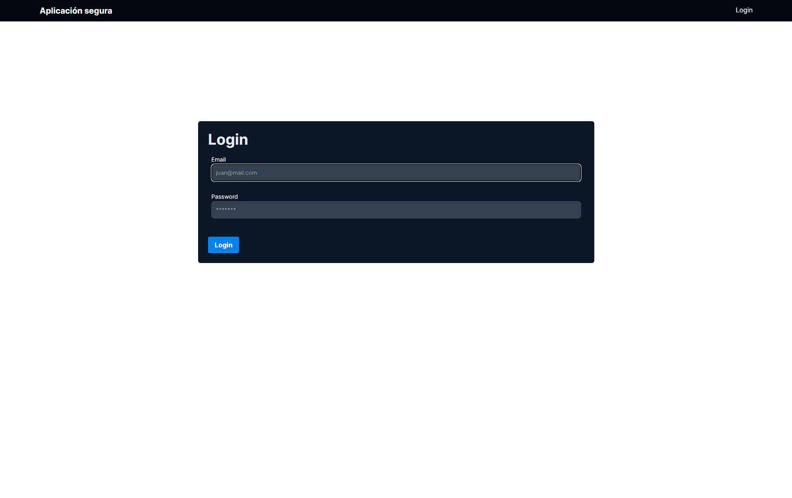
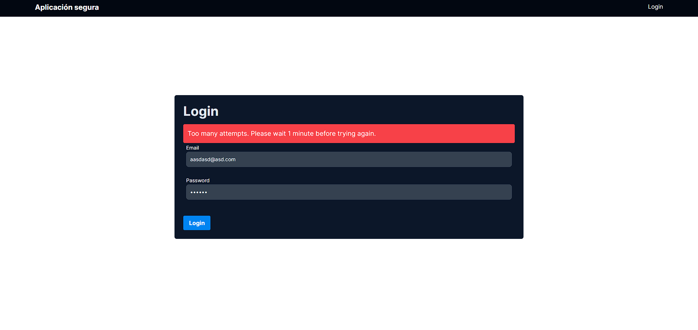
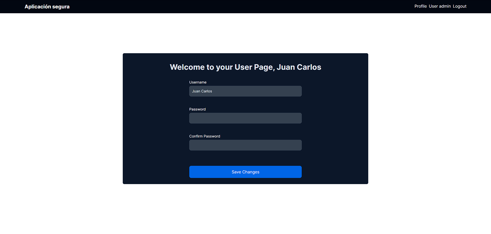
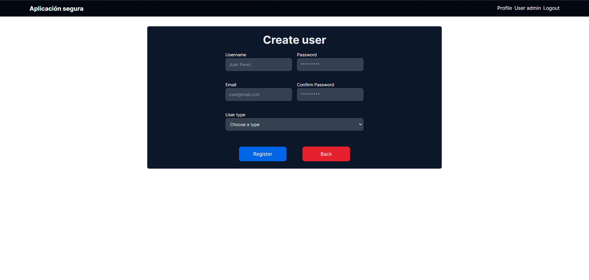

# app_segura

La aplicación app_segura fue creada para la asignatura Seguridad en Sistemas Computacionales del DuocUC.

La función de está página es de administrar usuarios y que los usuarios puedan administrar sus perfiles, el desarrollo de esta aplicación tuvo un enfoque en la seguridad, no en la funcionalidad de la aplicación en sí (Cuenta con un CRUD de usuarios).

Las vulnerabilidades que esta aplicación considera son las siguientes:
- SQL Injection: Todos los campos están validados para que no puedan realizar inyecciones de SQL.
- Fallas criptográficas: La transferencia de datos sensibles (Contraseña de usuario en este caso) está encriptado.
- Broken Access Control: Las cookies se encuentran encriptadas.
- Fallas de identificación y autenticación: Después de ingresar 3 veces seguidas credenciales de login erróneas se bloquea el login por un minuto.
- Diseño inseguro: Existe un módulo de administración de usuarios y los privilegios se manejan con roles de usuarios (Usuario y administrador).

<h2>Login:</h2>

<h2>Bloqueo de login:</h2>

<h2>Página de perfil:</h2>

<h2>Página de administración de usuarios:</h2>

<h2>Página de creación de usuarios.:</h2>

